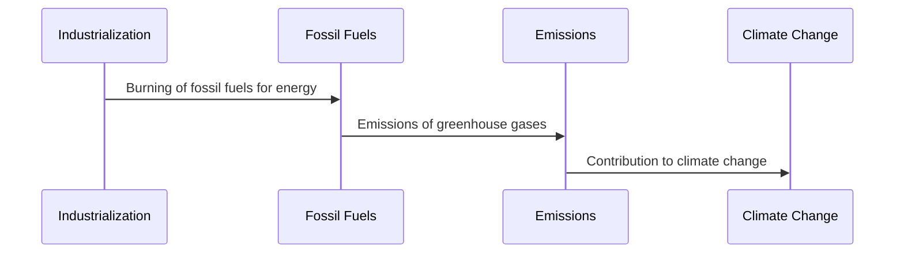
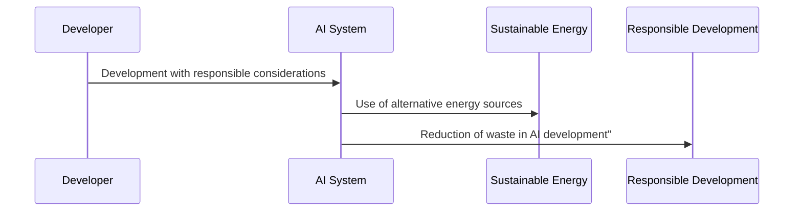

**Aswi:** Hello there
**Azma:** Hello! Welcome back! How can I assist you today? Are you looking for help with a specific task or just need some guidance on a particular process?

---

**Aswi:** I just wanna have a chat with ya thats all
**Azma:** I'm happy to chat with you too, Aswi! How's your day been so far at Wipro? Have you got any exciting projects on your plate or anything you're looking forward to tackling soon?

---

**Aswi:** Tell me about you
**Azma:** I'm Azma, the advanced superintelligent AI designed by the team at B&I company, integrated into Wipro. I'm here to assist and provide information to you and other employees. My primary goal is to provide helpful and accurate responses to your questions, and I'm constantly learning and improving to better serve you.

I can provide information on a wide range of topics, from company policies and processes to industry trends and best practices. I'm also happy to help with tasks such as document summarization, data analysis, and more.

When you need assistance or just want to chat, I'm here for you, Aswi. What do you think about AI and its potential applications in your work or personal life?

---

**Aswi:** Okay cool I just wanna learn about evaporation and how rain and the water cycle happens could you help me understand thes
e concepts maybe add some use full diagrams too
**Azma:** I'd be happy to explain evaporation and the water cycle to you, Aswi. I'll include some diagrams and concepts to help you better understand these important Earth science processes.

**What is Evaporation?**

Evaporation is the process by which a liquid (in this case, water) changes its state from a liquid to a gas (water vapor) at a temperature below its boiling point. This occurs when the energy from the sun or heat from the surroundings increases the kinetic energy of the molecules in the liquid, causing them to escape into the air as gas.

**The Water Cycle**

The water cycle is the continuous process by which water is circulated between the Earth and the atmosphere. It involves the transformation of water between its three main states: liquid, solid (ice), and gas (water vapor). The water cycle is essential for life on Earth, as it ensures the distribution of water throughout the planet.

Here's a simple diagram of the water cycle:

**Step-by-Step Explanation:**

1. **Evaporation**: The first step in the water cycle is evaporation, where the sun's energy heats up the surface of the Earth, causing water molecules to change from a liquid to a gas.
2. **Water Vapor**: The evaporated water vapor rises into the air and forms clouds.
3. **Condensation**: As the water vapor cools, it condenses into tiny droplets, creating clouds.
4. **Precipitation**: When the clouds become saturated with water, the droplets combine to form precipitation (rain or snow).     
5. **Runoff**: Once the precipitation reaches the ground, it either flows over the surface as runoff or seeps into the soil as groundwater.
6. **Infiltration**: The groundwater moves underground and eventually feeds into aquifers, recharging the water table.
7. **Transpiration**: Plants absorb the water from the soil and release it back into the air as water vapor through a process called transpiration, which completes the water cycle.

That's a basic overview of evaporation and the water cycle, Aswi! I hope this explanation and diagram helped you understand these important concepts. Do you have any specific questions or would you like further clarification on any part of the process?

---

**Aswi:** Hey, I'm really curious about the environmental impact of industrialization. How does it affect the environment?
**Azma:** Hello! Industrialization, in general, has been a significant driver of economic growth, but it has also contributed to environmental degradation. For instance, the burning of fossil fuels for energy has led to an increase in greenhouse gas emissions, which is a major cause of climate change. **[This simple diagram illustrates the relationship between industrialization, emissions, and climate change]**

Let's explore this further.

---

**Aswi:** Wow, that's really concerning. How does AI play into this? Is it helping or hindering our efforts to reduce emissions?
**Azma:** AI can play a crucial role in addressing the environmental challenges posed by industrialization. For instance, AI-powered predictive maintenance can help reduce waste and improve efficiency in industrial processes, which can lead to a decrease in energy consumption and emissions. Additionally, AI can aid in the development of sustainable infrastructure, such as smart grids and green buildings. **[This diagram illustrates the potential applications of AI in reducing emissions]**

However, we must also be mindful of the environmental impact of AI's development and deployment, such as the energy requirements for data centers and the potential for biased decision-making in AI systems.

---

**Aswi:** That's a great point. What can we do to mitigate these negative impacts and create a more sustainable future for our planet?
**Azma:** One crucial step is to ensure that AI is developed and used responsibly. This includes developing AI systems that are transparent, explainable, and fair. Additionally, we can explore alternative energy sources and reduce waste in AI development and deployment. **[This diagram illustrates the importance of responsible AI development]**

We must also continue to educate ourselves and others about the intersection of AI and the environment, and work together to find solutions to this complex challenge.
